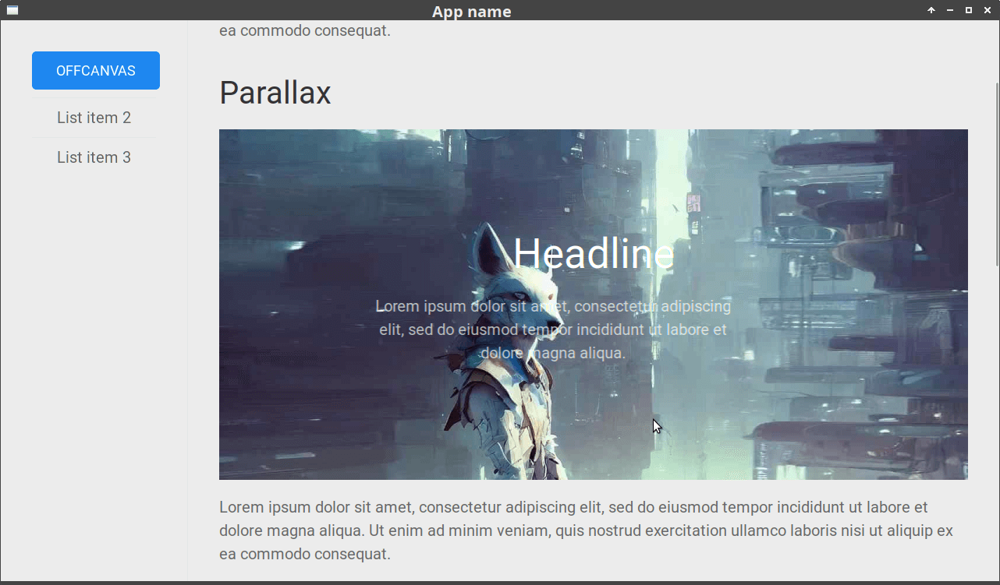

# sglui-engine
Engine for parametric creation of applications with UI in Golang 



## dependencies

1. Go 1.8+
2. Wails (GUI lib)
3. NPM 9.5.1+

## how to install dependencies

Let's look at the example of installation on Ubuntu:

install wails

```bash
go install github.com/wailsapp/wails/v2/cmd/wails@latest
```

to check other dependencies:

```bash
wails doctor
```

result example:

```
# Wails Dependencies
┌──────────────────────────────────────────────────────────────────────────┐
| Dependency | Package Name          | Status    | Version                 |
| *docker    | docker.io             | Installed | 20.10.18                |
| gcc        | build-essential       | Installed | 12.8ubuntu1             |
| libgtk-3   | libgtk-3-dev          | Available | 3.24.18-1ubuntu1        |
| libwebkit  | libwebkit2gtk-4.0-dev | Available | 2.38.6-0ubuntu0.20.04.1 |
| npm        | npm                   | Installed | 9.5.1                   |
| *nsis      | nsis                  | Available | 3.05-2                  |
| pkg-config | pkg-config            | Installed | 0.29.1-0ubuntu4         |
└──────────────────────── * - Optional Dependency ─────────────────────────┘
```

install another libs:

```bash
sudo aptitude install libwebkitgtk-3.0-dev
sudo aptitude install libgtk-3-dev
```

If `libgtk-3-dev` will not be installed, then skip the first sentence of `aptitude` and accept the second with downgrade of the associated libraries.

## run dev version

```bash
wails dev
```

## build for linux

```bash
wails build -platform linux/amd64
```

## build for windows

```bash
wails build -platform windows/amd64
```
